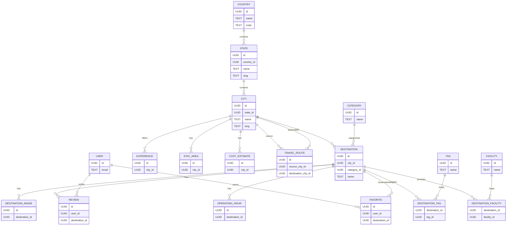

```mermaid
erDiagram

COUNTRY ||--o{ STATE : contains
STATE ||--o{ CITY : contains

CITY ||--o{ DESTINATION : has
CATEGORY ||--o{ DESTINATION : categorizes

DESTINATION ||--o{ DESTINATION_IMAGE : has
DESTINATION ||--o{ REVIEW : has
DESTINATION ||--o{ OPERATING_HOUR : has

CITY ||--o{ EXPERIENCE : offers
CITY ||--o{ STAY_AREA : has
CITY ||--o{ COST_ESTIMATE : has

CITY ||--o{ TRAVEL_ROUTE : source
CITY ||--o{ TRAVEL_ROUTE : destination

USER ||--o{ REVIEW : writes
USER ||--o{ FAVORITE : saves

DESTINATION ||--o{ FAVORITE : bookmarked

DESTINATION ||--o{ DESTINATION_TAG : tagged
TAG ||--o{ DESTINATION_TAG : maps

DESTINATION ||--o{ DESTINATION_FACILITY : provides
FACILITY ||--o{ DESTINATION_FACILITY : maps


COUNTRY {
    UUID id
    TEXT name
    TEXT code
}

STATE {
    UUID id
    UUID country_id
    TEXT name
    TEXT slug
}

CITY {
    UUID id
    UUID state_id
    TEXT name
    TEXT slug
}

CATEGORY {
    UUID id
    TEXT name
}

DESTINATION {
    UUID id
    UUID city_id
    UUID category_id
    TEXT name
}

DESTINATION_IMAGE {
    UUID id
    UUID destination_id
}

EXPERIENCE {
    UUID id
    UUID city_id
}

STAY_AREA {
    UUID id
    UUID city_id
}

TRAVEL_ROUTE {
    UUID id
    UUID source_city_id
    UUID destination_city_id
}

COST_ESTIMATE {
    UUID id
    UUID city_id
}

USER {
    UUID id
    TEXT email
}

FAVORITE {
    UUID id
    UUID user_id
    UUID destination_id
}

REVIEW {
    UUID id
    UUID user_id
    UUID destination_id
}

TAG {
    UUID id
    TEXT name
}

DESTINATION_TAG {
    UUID destination_id
    UUID tag_id
}

OPERATING_HOUR {
    UUID id
    UUID destination_id
}

FACILITY {
    UUID id
    TEXT name
}

DESTINATION_FACILITY {
    UUID destination_id
    UUID facility_id
}
```
