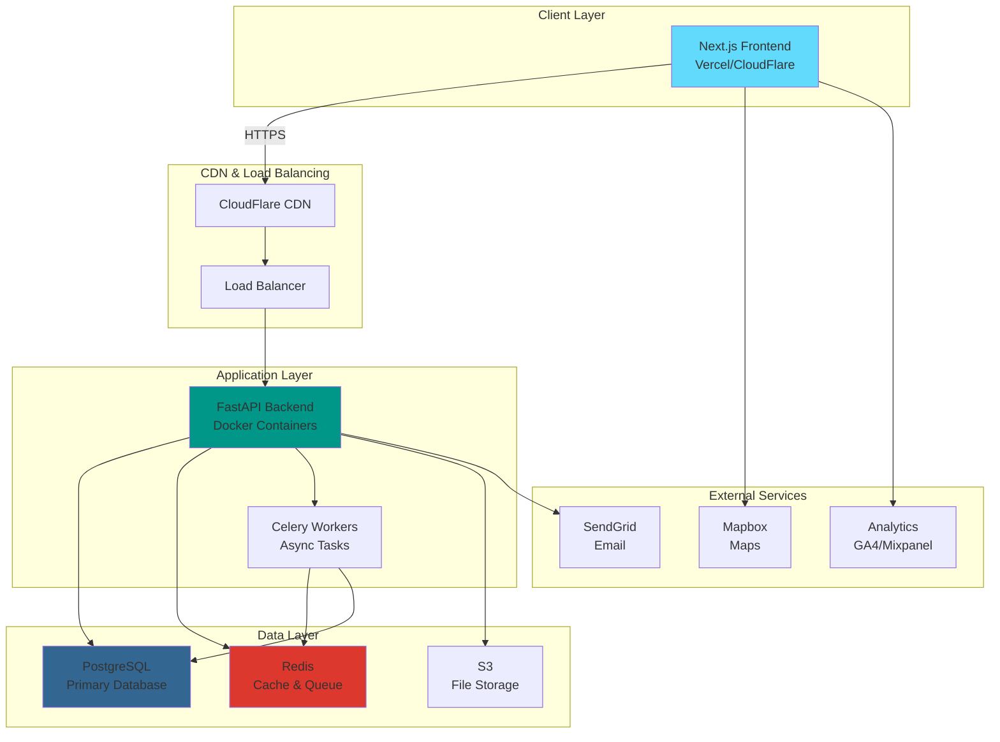

# Travel Information & Planning Platform — Technical Stack

## 1. Executive Summary

This document defines the complete technical architecture for the **Travel Information & Planning Platform**. Based on your requirements for a Python backend and scalable architecture, this stack is designed to support:

- **Current MVP**: Information-rich travel planning with structured data
- **Future Growth**: ML recommendations, community features, video content, real-time pricing
- **Scale Target**: Thousands of concurrent users with room to grow

---

## 2. Technology Stack Overview

### 2.1 Backend Stack

| Component | Technology | Justification |
|-----------|-----------|---------------|
| **Framework** | **FastAPI** | Modern Python async framework, auto-generated API docs, excellent performance, built-in validation with Pydantic |
| **Language** | **Python 3.11+** | Your preference, excellent ecosystem for data processing and future ML integration |
| **API Architecture** | **RESTful APIs** | Standard, well-understood, easy to consume from any frontend |
| **Authentication** | **JWT (JSON Web Tokens)** | Stateless, scalable, industry standard for API authentication |
| **Task Queue** | **Celery + Redis** | For async tasks (email sending, data updates, future ML processing) |
| **Caching** | **Redis** | Fast in-memory caching for frequently accessed data (city info, distances) |
| **Data Validation** | **Pydantic** | Built into FastAPI, ensures type safety and data integrity |

**Why FastAPI over Flask/Django?**
- **Performance**: 3-4x faster than Flask, comparable to Node.js
- **Modern**: Async/await support, automatic API documentation (Swagger/OpenAPI)
- **Developer Experience**: Type hints, auto-completion, fewer bugs
- **Future-proof**: Growing ecosystem, excellent for ML model serving

---

### 2.2 Frontend Stack

| Component | Technology | Justification |
|-----------|-----------|---------------|
| **Framework** | **Next.js 14** (React) | SSR/SSG for SEO, excellent performance, large ecosystem, TypeScript support |
| **Language** | **TypeScript** | Type safety, better developer experience, fewer runtime errors |
| **UI Library** | **Tailwind CSS** | Rapid development, consistent design system, highly customizable |
| **Component Library** | **shadcn/ui** | Modern, accessible, customizable components built on Radix UI |
| **State Management** | **Zustand** | Lightweight, simple API, perfect for medium-complexity apps |
| **Data Fetching** | **TanStack Query (React Query)** | Caching, background updates, optimistic updates, excellent DX |
| **Maps Integration** | **Mapbox GL JS** | Beautiful maps, excellent performance, customizable styling |
| **Charts/Visualizations** | **Recharts** | Simple, composable charts for cost/distance visualizations |

**Why Next.js?**
- **SEO Critical**: Your platform is information-first, needs excellent search visibility
- **Performance**: Server-side rendering, automatic code splitting, image optimization
- **Developer Experience**: Hot reload, TypeScript support, excellent documentation
- **Deployment**: Vercel (creators of Next.js) offers seamless deployment

**Alternative Consideration**: If you prefer a lighter approach, **Vite + React** is also excellent, but you'll lose built-in SSR/SSG benefits.

---

### 2.3 Database Stack

| Component | Technology | Justification |
|-----------|-----------|---------------|
| **Primary Database** | **PostgreSQL 15+** | Robust, ACID compliant, excellent for structured travel data, supports JSON for flexibility |
| **ORM** | **SQLAlchemy 2.0** | Industry standard Python ORM, async support, excellent query capabilities |
| **Migrations** | **Alembic** | Standard migration tool for SQLAlchemy, version control for database schema |
| **Search Engine** | **PostgreSQL Full-Text Search** (MVP) → **Elasticsearch** (Future) | Start simple with Postgres, migrate to Elasticsearch when search becomes complex |
| **Vector Database** | **pgvector** (Future) | For ML-based recommendations, embeddings for semantic search |

**Why PostgreSQL?**
- **Structured Data**: Perfect for your relational data (cities, places, distances, costs)
- **JSON Support**: Flexibility for semi-structured data (experience recommendations, user preferences)
- **Geospatial**: PostGIS extension for location-based queries
- **Scalability**: Proven at scale, excellent replication and partitioning
- **Cost-Effective**: Open source, widely supported by cloud providers

---

### 2.4 DevOps & Infrastructure

| Component | Technology | Justification |
|-----------|-----------|---------------|
| **Containerization** | **Docker** | Consistent environments, easy deployment, industry standard |
| **Orchestration** | **Docker Compose** (Dev/Staging) → **Kubernetes** (Production Scale) | Start simple, scale when needed |
| **CI/CD** | **GitHub Actions** | Free for public repos, integrated with GitHub, powerful workflow automation |
| **Cloud Provider** | **AWS** (Recommended) or **Google Cloud Platform** | AWS: Largest ecosystem, most services. GCP: Better pricing, excellent for ML |
| **Hosting** | **AWS EC2/ECS** or **GCP Cloud Run** | EC2/ECS: Full control. Cloud Run: Serverless, auto-scaling, cost-effective |
| **CDN** | **CloudFlare** | Free tier, excellent performance, DDoS protection, caching |
| **Monitoring** | **Sentry** (Errors) + **Prometheus + Grafana** (Metrics) | Comprehensive error tracking and performance monitoring |
| **Logging** | **ELK Stack** (Elasticsearch, Logstash, Kibana) or **AWS CloudWatch** | Centralized logging, debugging, analytics |

---

### 2.5 Additional Services

| Service | Technology | Purpose |
|---------|-----------|---------|
| **Email** | **SendGrid** or **AWS SES** | Transactional emails, newsletters |
| **File Storage** | **AWS S3** or **Cloudinary** | User-uploaded videos (future), images |
| **Analytics** | **Google Analytics 4** + **Mixpanel** | User behavior tracking, conversion analytics |
| **API Documentation** | **FastAPI Auto-docs** (Swagger/ReDoc) | Automatic, always up-to-date API documentation |
| **Version Control** | **Git + GitHub** | Code versioning, collaboration |

---

## 3. Architecture Diagram



---

## 4. Development Environment Setup

### 4.1 Required Tools

```bash
# Backend
- Python 3.11+
- pip / poetry (dependency management)
- PostgreSQL 15+
- Redis 7+
- Docker Desktop

# Frontend
- Node.js 20+ (LTS)
- npm / yarn / pnpm
- VS Code (recommended IDE)

# DevOps
- Git
- Docker & Docker Compose
- AWS CLI / GCP CLI (for deployment)
```

### 4.2 Recommended VS Code Extensions

**Backend:**
- Python
- Pylance
- Python Debugger
- Docker
- PostgreSQL (Chris Kolkman)

**Frontend:**
- ES7+ React/Redux/React-Native snippets
- Tailwind CSS IntelliSense
- Prettier - Code formatter
- ESLint

---

## 5. Tech Stack Comparison Matrix

### 5.1 Backend Framework Comparison

| Feature | FastAPI | Flask | Django |
|---------|---------|-------|--------|
| Performance | ⭐⭐⭐⭐⭐ | ⭐⭐⭐ | ⭐⭐⭐ |
| Async Support | ✅ Native | ⚠️ Limited | ⚠️ Limited |
| API Documentation | ✅ Auto-generated | ❌ Manual | ⚠️ DRF required |
| Learning Curve | ⭐⭐⭐ | ⭐⭐ | ⭐⭐⭐⭐ |
| Type Safety | ✅ Pydantic | ❌ | ⚠️ Limited |
| Best For | APIs, ML serving | Simple apps | Full-stack monoliths |

**Recommendation**: **FastAPI** for your use case (API-first, future ML integration)

---

### 5.2 Frontend Framework Comparison

| Feature | Next.js | Vite+React | Vue.js | Angular |
|---------|---------|------------|--------|---------|
| SEO | ⭐⭐⭐⭐⭐ | ⭐⭐ | ⭐⭐⭐ | ⭐⭐⭐⭐ |
| Performance | ⭐⭐⭐⭐⭐ | ⭐⭐⭐⭐⭐ | ⭐⭐⭐⭐ | ⭐⭐⭐ |
| Developer Experience | ⭐⭐⭐⭐⭐ | ⭐⭐⭐⭐ | ⭐⭐⭐⭐ | ⭐⭐⭐ |
| Ecosystem | ⭐⭐⭐⭐⭐ | ⭐⭐⭐⭐ | ⭐⭐⭐⭐ | ⭐⭐⭐⭐ |
| Learning Curve | ⭐⭐⭐ | ⭐⭐ | ⭐⭐ | ⭐⭐⭐⭐ |
| Best For | SEO-critical apps | SPAs, dashboards | Progressive apps | Enterprise apps |

**Recommendation**: **Next.js** for SEO and performance (critical for travel content)

---

### 5.3 Database Comparison

| Feature | PostgreSQL | MongoDB | MySQL |
|---------|-----------|---------|-------|
| Data Structure | Relational + JSON | Document | Relational |
| ACID Compliance | ✅ | ⚠️ Limited | ✅ |
| Scalability | ⭐⭐⭐⭐ | ⭐⭐⭐⭐⭐ | ⭐⭐⭐⭐ |
| Geospatial | ✅ PostGIS | ✅ | ⚠️ Limited |
| Full-Text Search | ✅ | ✅ | ⚠️ Basic |
| Best For | Structured data | Flexible schemas | Simple relational |

**Recommendation**: **PostgreSQL** for your structured travel data with JSON flexibility

---

## 6. Scalability Considerations

### 6.1 Current MVP (0-10K users)

```
Architecture: Monolith
- Single FastAPI instance
- Single PostgreSQL instance
- Redis for caching
- Deployed on single EC2/Cloud Run instance

Cost: ~$50-100/month
```

### 6.2 Growth Phase (10K-100K users)

```
Architecture: Horizontal Scaling
- Multiple FastAPI instances (load balanced)
- PostgreSQL with read replicas
- Redis cluster
- CDN for static assets
- Separate Celery workers

Cost: ~$300-500/month
```

### 6.3 Scale Phase (100K+ users)

```
Architecture: Microservices (if needed)
- Separate services for:
  - User management
  - Search & recommendations
  - Content management
  - ML/AI features
- PostgreSQL with partitioning
- Elasticsearch for search
- Kubernetes orchestration

Cost: ~$1000+/month
```

---

## 7. Security Considerations

| Layer | Security Measure |
|-------|-----------------|
| **Authentication** | JWT tokens with refresh mechanism, bcrypt password hashing |
| **API** | Rate limiting (SlowAPI), CORS configuration, input validation |
| **Database** | Parameterized queries (SQLAlchemy ORM), encrypted connections |
| **Infrastructure** | HTTPS only, security headers, DDoS protection (CloudFlare) |
| **Secrets** | Environment variables, AWS Secrets Manager / GCP Secret Manager |
| **Monitoring** | Sentry for error tracking, audit logs for sensitive operations |

---

## 8. Cost Estimation (Monthly)

### MVP Phase (First 6 months)

| Service | Provider | Cost |
|---------|----------|------|
| Backend Hosting | AWS EC2 t3.small or GCP Cloud Run | $15-30 |
| Database | AWS RDS PostgreSQL (db.t3.micro) | $15-25 |
| Redis | AWS ElastiCache (cache.t3.micro) | $12-15 |
| CDN | CloudFlare Free | $0 |
| Domain | Namecheap/GoDaddy | $10-15/year |
| Email | SendGrid Free (100 emails/day) | $0 |
| Monitoring | Sentry Free tier | $0 |
| **Total** | | **~$50-80/month** |

### Growth Phase (After 6-12 months)

| Service | Provider | Cost |
|---------|----------|------|
| Backend Hosting | Multiple instances | $100-150 |
| Database | Larger instance + replicas | $80-120 |
| Redis | Cluster | $30-50 |
| CDN | CloudFlare Pro | $20 |
| Storage (S3) | For user videos | $20-50 |
| Email | SendGrid Essentials | $20 |
| Monitoring | Sentry Team | $26 |
| **Total** | | **~$300-500/month** |

---

## 9. Technology Alternatives (If Needed)

### 9.1 If You Want Simpler Stack

**Backend**: Flask + SQLAlchemy (simpler than FastAPI, but less performant)  
**Frontend**: Vite + React (no SSR, but faster development)  
**Database**: SQLite (development) → PostgreSQL (production)  
**Deployment**: Heroku (easier than AWS, but more expensive at scale)

### 9.2 If You Want Cutting-Edge Stack

**Backend**: FastAPI + async SQLAlchemy  
**Frontend**: Next.js 14 with Server Components  
**Database**: PostgreSQL + pgvector for ML  
**Deployment**: Kubernetes on GCP with auto-scaling  
**Search**: Elasticsearch with ML-powered recommendations

---

## 10. Recommended Tech Stack Summary

Based on your requirements (Python backend, scalability, future ML features):

```yaml
Backend:
  Framework: FastAPI
  Language: Python 3.11+
  Database: PostgreSQL 15+
  ORM: SQLAlchemy 2.0
  Cache: Redis
  Task Queue: Celery

Frontend:
  Framework: Next.js 14
  Language: TypeScript
  Styling: Tailwind CSS
  Components: shadcn/ui
  State: Zustand
  Data Fetching: TanStack Query

Infrastructure:
  Cloud: AWS (or GCP)
  CI/CD: GitHub Actions
  Containers: Docker
  CDN: CloudFlare
  Monitoring: Sentry + Prometheus

Development:
  Version Control: Git + GitHub
  API Docs: FastAPI auto-docs
  Testing: pytest (backend), Jest + React Testing Library (frontend)
```

---

## 11. Next Steps

After reviewing this tech stack document:

1. **Review & Approve**: Confirm this stack aligns with your vision
2. **Database Design**: I'll create detailed database schema document
3. **CI/CD Setup**: I'll create deployment pipeline documentation
4. **Project Skeleton**: Set up initial folder structure and boilerplate
5. **Development Roadmap**: Detailed sprint planning for MVP

---

## 12. Questions for You

Before proceeding to database design and CI/CD documentation:

1. **Cloud Preference**: AWS or Google Cloud Platform? (AWS recommended for ecosystem, GCP for pricing)
2. **Deployment Complexity**: Start simple (single server) or plan for scale from day 1?
3. **Budget**: What's your monthly budget for infrastructure? (Helps determine hosting choices)
4. **Timeline**: When do you want to launch MVP? (Affects technology choices)
5. **Team Size**: Solo developer or team? (Affects tooling and CI/CD complexity)

Let me know your preferences, and I'll proceed with the **Database Schema & Models** document next! 🚀
